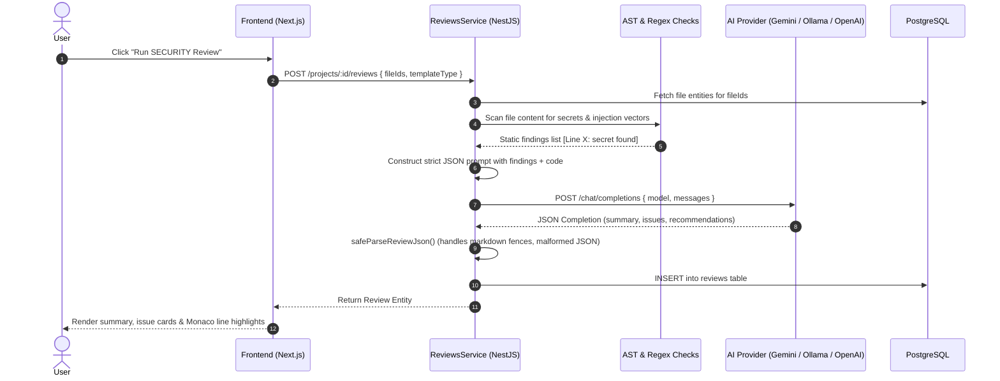

# System Architecture Document

This document outlines the architectural decisions, component hierarchy, database schema, and AI integration flows for the **AI-Powered Code Review Assistant**.

---

## 1. High-Level Architectural Overview

The application follows a decoupled client-server architecture:
- **Client (Frontend)**: Next.js 16 (React 19) App Router providing a responsive developer workspace with an integrated Monaco code editor and real-time state management.
- **API Server (Backend)**: NestJS enterprise application structured into domain-driven modules, leveraging TypeORM for PostgreSQL persistence, Tree-sitter for AST analysis, and an OpenAI-compatible adapter for model flexibility.
- **Database (PostgreSQL)**: Relational data store tracking users, projects, code files, review outputs, AI configurations, and conversational chat messages.
- **LLM Engine**: Provider-agnostic inference layer supporting both cloud APIs (Gemini, Groq, OpenAI) and local runtime instances (Ollama, LM Studio).

```mermaid
graph TD
    Client["Next.js 16 Client (Monaco Editor + Auth Context)"]
    API["NestJS Backend API (Port 3001)"]
    DB[("PostgreSQL 14+ (ai_code_review)")]
    AST["Tree-sitter AST & Static Check Engine"]
    LLM["Configurable LLM (Gemini / Ollama / LM Studio / OpenAI)"]

    Client -->|HTTP / REST (JWT)| API
    API -->|TypeORM Entities| DB
    API -->|Syntax Tree Slicing| AST
    API -->|OpenAI-Compatible Chat Completions| LLM
```

---

## 2. Frontend Architecture (Next.js App Router)

### State Management & Data Flow
- **Authentication Context (`context/auth-context.tsx`)**: Manages the reactive user lifecycle, token persistence in `localStorage`, automatic session rehydration against `/auth/me`, and route protection.
- **Typed API Client (`lib/api/client.ts`)**: Encapsulates all backend interaction with explicit TypeScript interfaces, automatic `Bearer` authorization header injection, and resilient error extraction.
- **Three-Pane Workspace Layout (`app/projects/[projectId]/page.tsx`)**:
  1. **Explorer Pane**: Hierarchical tree with nested folder toggle, file selection, ZIP archive upload, and Git repository cloning modal.
  2. **Monaco Code Viewer**: Synchronized syntax-highlighted editor with line-specific review highlight decorator and read-only protection.
  3. **Review & Chat Panel**: Tabbed interface switching between multi-mode review execution (Security, Performance, Quality, Architecture, Test Generator) and conversational RAG chat.

### Design System & Theme
- Built using **Tailwind CSS v4** with a sleek developer dark aesthetic (GitHub Dark / Linear style):
  - Primary Background: `#09090b` (Jet Black)
  - Card & Panel Surfaces: `#121215` / `#18181b`
  - High-Contrast Actions: `#f4f4f5` (Zinc-100) buttons with `#09090b` text
  - Standardized Severity Badges: Red (Critical), Orange (High), Yellow (Medium), Zinc (Low).

---

## 3. Backend Architecture (NestJS Modular System)

The backend follows clean separation of concerns divided into domain feature modules:

```
src/
├── auth/           # JwtStrategy, JwtAuthGuard, Bcrypt hashing, AuthController
├── users/          # UsersService, User entity
├── projects/       # ProjectsService, ProjectsController, Project entity
├── files/          # FilesController, FilesService, ZipExtractor, TreeBuilder
├── parsing/        # Tree-sitter parsers (TS, JS, Python, Go) & static checkers
├── ai-providers/   # GenericOpenAiCompatibleProvider, AiProviderFactory, ConfigService
├── reviews/        # ReviewsService, ReviewsController, 5 review templates, SafeJsonParser
└── chat/           # ChatService, ChatController, RetrievalService, Session entities
```

### Key Technical Implementations:

1. **Robust File Processing (`files/`)**:
   - **Binary & Null-Byte Sanitizer**: Real repositories contain images, compiled binaries, and git pack files. The extractor inspects binary signatures and sanitizes text (`.replace(/\0/g, '')`) before database writes, eliminating PostgreSQL `0x00 UTF-8` encoding exceptions.
   - **Junk Pruning**: Automatically skips `node_modules`, `.git`, `.next`, `dist`, `build`, and virtual environments.
   - **Git Shallow Cloner**: Clones public repositories with `git clone --depth 1` into a temporary directory, walks source files, and cleans up temporary disk space.
   - **Batch Database Ingestion**: Inserts extracted files in chunks of 100 to prevent exceeding PostgreSQL parameter query limits.

2. **Static Code Analysis (`parsing/`)**:
   - Uses **Tree-sitter** AST parsers for JavaScript, TypeScript, Python, and Go.
   - Runs deterministic static security checks:
     - Hardcoded API keys, JWT tokens, AWS credentials, and private keys.
     - SQL Injection risks (string concatenations in query strings) and command injection vectors.
   - Findings are pre-computed and injected directly into the LLM prompt to ground the AI model with verified line references.

3. **Multi-Model Provider Factory (`ai-providers/`)**:
   - Any model endpoint implementing the standard `/chat/completions` protocol is supported.
   - Dynamic configuration resolution: Checks database per-project config first, then falls back to `backend/.env` without requiring process restarts.

---

## 4. Database Schema Design (PostgreSQL + TypeORM)

```
┌──────────────────┐       1:N       ┌──────────────────┐
│      users       │ ─────────────── │     projects     │
│──────────────────│                 │──────────────────│
│ id (UUID, PK)    │                 │ id (UUID, PK)    │
│ email (unique)   │                 │ name (varchar)   │
│ password (hash)  │                 │ description      │
│ name (varchar)   │                 │ ownerId (FK)     │
│ createdAt (date) │                 │ createdAt (date) │
└──────────────────┘                 └──────────────────┘
                                              │
                    ┌─────────────────────────┼─────────────────────────┐
                    │ 1:N                     │ 1:N                     │ 1:1
                    ▼                         ▼                         ▼
         ┌──────────────────┐      ┌──────────────────┐      ┌──────────────────────┐
         │      files       │      │     reviews      │      │ ai_provider_configs  │
         │──────────────────│      │──────────────────│      │──────────────────────│
         │ id (UUID, PK)    │      │ id (UUID, PK)    │      │ id (UUID, PK)        │
         │ path (varchar)   │      │ templateType     │      │ providerType         │
         │ name (varchar)   │      │ targetFiles json │      │ baseUrl (varchar)    │
         │ content (text)   │      │ summary (text)   │      │ apiKey (nullable)    │
         │ projectId (FK)   │      │ issues (jsonb)   │      │ model (varchar)      │
         └──────────────────┘      │ recommendations  │      │ projectId (FK)       │
                                   │ projectId (FK)   │      └──────────────────────┘
                                   └──────────────────┘
                                              │ 1:N
                                              ▼
                                   ┌──────────────────┐       1:N       ┌──────────────────┐
                                   │  chat_sessions   │ ─────────────── │     messages     │
                                   │──────────────────│                 │──────────────────│
                                   │ id (UUID, PK)    │                 │ id (UUID, PK)    │
                                   │ title (nullable) │                 │ role (user/asst) │
                                   │ projectId (FK)   │                 │ content (text)   │
                                   └──────────────────┘                 │ sessionId (FK)   │
                                                                        └──────────────────┘
```

---

## 5. AI Integration Flow & Prompt Engineering



### Prompt Guardrails
To prevent hallucinated schemas, markdown formatting corruption, or conversational preambles from crashing downstream parsers:
- **Strict Format Demarcation**: Prompts instruct the model to return *ONLY* valid JSON conforming to an explicit schema.
- **`safeParseReviewJson`**: Cleans leading/trailing markdown code fences (````json ... ````), extracts JSON substrings via regex delimiters, and injects default empty collections if parsing fails.
